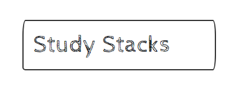

# Study Stacks

Study Stacks is a powerful online learning platform designed to facilitate efficient and effective studying through the use of flash cards. The platform is written in C# and utilizes Razor Pages for a seamless user experience.

## About Flash Cards

Flash cards have long been recognized as an excellent tool for memorization and learning. The concept is simple: write a question or prompt on one side of a card, and the answer on the other. This method engages active recall, enabling the learner to strengthen neural connections and improve memory retention.

## Why Study Stacks?

At Study Stacks, we've taken the proven benefits of flash cards and incorporated them into a user-friendly, digital format. You can now create, manage, and study your flash cards online, anytime, anywhere. Our platform also offers additional features like tracking your progress over time and organizing your cards into different stacks for better organization and focused learning.

## Technologies Used

Study Stacks is built with C# using the ASP.NET Core framework. Razor Pages, a feature of ASP.NET Core MVC, is used for creating a clean, functional user interface. Data persistence is handled with Entity Framework Core, which allows for easy data access and manipulation.

## Getting Started

Study Stacks is easy to use. Simply sign up for a free account and start creating your own flash cards. You can organize your cards into different stacks for various subjects or study topics.

We hope you enjoy using Study Stacks as much as we enjoyed building it. Happy studying!
